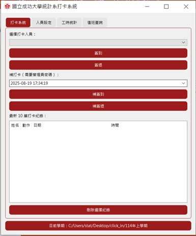

# 國立成功大學統計系打卡系統

一個以 **PyQt5** 與 **openpyxl** 開發的桌面應用程式，用於管理人員出勤打卡、工時統計與值班查詢。  
專為國立成功大學統計系內部需求設計，支援人員管理、補打卡與工時計算，並能匯出 Excel 報表。

---

## 功能特色

- **打卡系統**
  - 即時簽到 / 簽退
  - 管理員驗證的補打卡功能
  - 最近 10 筆打卡紀錄檢視與刪除

- **人員管理**
  - 新增與刪除人員
  - 人員名單保存於 Excel 檔案 (`staff.xlsx`)

- **工時統計**
  - 設定應到工時
  - 自動計算實際工時與差異
  - 匯出完整工時報表至 Excel
  - 可篩選起訖日期

- **值班查詢**
  - 查詢指定人員的簽到/簽退紀錄
  - 計算值班時長
  - 支援日期範圍篩選

---

## 安裝與執行

### 1. 環境需求
- Python 3.8+
- 需要安裝以下套件：
  ```bash
  pip install pyqt5 openpyxl
  
## 使用介面


